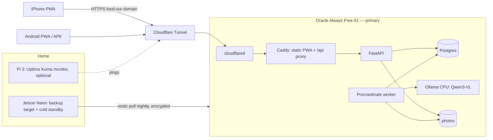

# Food Buddy — Design plan (mock → real app)

Date: 2026-10-04 · Status: draft v3 (hardware known: Pi 3 B, original Jetson Nano → Oracle primary)

This plan turns the clickable mock (`index.html`) into a real app. It covers the tech stack, how the app is served (Docker on Oracle Always Free, with our home hardware as backup), and research on open-source food-analysis models. Choices are recorded in `docs/decisions/0015`–`0019`.

---

## 1. Constraints and goals

| Constraint | Consequence |
|---|---|
| Both of us have **iPhones**; Android should work too | iPhone: installable web app (PWA). Android: PWA + APK (§2) |
| **Zero cost**: no Apple Developer fee, no paid APIs, not distributing yet (0019) | No App Store/TestFlight; self-hosted model; free tiers only where nothing can bill us |
| **Open source** (0019) | Public repo, open license, dependencies with compatible licenses (§7) |
| API in **FastAPI** (0015) | Python backend; the AI pipeline lives in Python too |
| Served with **Docker** on free or owned hardware (0016) | One `docker compose` stack: Oracle primary, Jetson backup (§5) |
| Domain on **Cloudflare** | Cloudflare Tunnel gives HTTPS with no open ports (§5) |
| Two users, one household | Simple auth, small data |

Useful fact: **every target is ARM64** (Oracle Ampere A1, Jetson Nano, Pi 3 with a 64-bit OS), and GitHub gives **free arm64 CI runners to public repos**. We build one `linux/arm64` image set.

---

## 2. Client: web-first PWA + Capacitor (proposed, 0017 revised)

**What changed:** iOS apps installed without the 99 USD/year Apple Developer Program only work through a free Xcode signing that expires every 7 days. So on our iPhones the app will be the **home-screen web app (PWA)** day to day. Web quality is now the top priority, and the mock's HTML/CSS can be reused.

**Recommendation: React + TypeScript + Vite, built as a PWA, wrapped with Capacitor for Android (and optionally iOS).**

| Platform | How we run it | Cost |
|---|---|---|
| iPhone (both of us) | Safari → Share → *Add to Home Screen*. Full-screen, own icon, offline cache, **Web Push works on iOS 16.4+** for home-screen apps | 0 |
| Android | Same PWA (Chrome install), **or** a Capacitor APK built locally and sideloaded | 0 |
| iPhone native (optional) | Capacitor iOS build from Xcode with a free Apple ID; re-signed every 7 days. Only if a PWA limit hurts | 0 |
| Desktop | Same web app | 0 |

- **UI:** port the mock's `:root` tokens and CSS almost 1:1 (CSS modules or plain CSS); screens become React components; React Router replaces the hash router.
- **PWA:** `vite-plugin-pwa` (service worker, manifest, offline app shell).
- **Camera / photos:** `<input type="file" accept="image/*" capture="environment">` opens the iPhone camera natively. Photos are resized on the device to ~1280 px JPEG before upload.
- **Barcodes:** `zxing-js` in the browser (Safari has no `BarcodeDetector`); Capacitor ML Kit plugin in the Android APK.
- **Data:** TanStack Query with persisted cache (IndexedDB); API types generated from FastAPI's OpenAPI (`openapi-typescript`).
- **Push:** standard Web Push (VAPID) sent by the backend with `pywebpush`. Free, no Firebase needed for the PWA (the APK can use FCM later).

**Why not Expo anymore:** Expo is the better fit when native store apps are the target. Ours is mainly a PWA on iPhone. Expo's web output (react-native-web) is weaker than a real web app, and the mock's CSS wouldn't carry over. Capacitor keeps the native path open (APK now, iOS later if we ever pay) without making the web version worse.

---

## 3. Backend: FastAPI (accepted, 0015)

| Concern | Choice | Why |
|---|---|---|
| API | FastAPI + Pydantic v2, uvicorn | Known; OpenAPI → typed client |
| ORM / migrations | SQLAlchemy 2 (or SQLModel) + Alembic | Standard, async-capable |
| Database | **PostgreSQL 16** (+ `pg_trgm`) | Fuzzy ingredient search over the nutrition DB; API + worker write at the same time |
| Background jobs | **Procrastinate** (Postgres-backed queue) | AI analysis is async; no Redis |
| Photos | Docker volume behind a small `Storage` interface | Simple; backed up with restic |
| Auth | Household with 2 users; email + password (argon2), access + refresh tokens | Two people don't need an identity provider |
| Live updates | Web Push ("analysis ready", "partner rated", "approve the plan") + refetch on focus | No WebSockets in v1 |

### Domain model (from the mock)

`Household`, `User` · `Meal` (type, photo, servings, prep time, cost, recipe steps) · `MealIngredient` (ingredient, grams) · `Ingredient` (nutrition per 100 g, source: USDA/Ciqual/OFF/custom, aliases, default buy qty, price) · `Rating` (user, taste 0.5–5, make again, worth effort, fullness, note) · `CookLog` · `PlanWeek` / `PlanSlot` (day, meal type, mode cook/prep/out/skip, approvals) · `ShoppingItem` · `InventoryItem` (fridge/pantry, qty, expiry) · `Snack` (kind sweet/savory/drink, source photo/label/barcode/list) · `Goal` · `PushSubscription` · `AnalysisJob` (status, provider, raw model output, user corrections).

### Module layout

```
api/
  app/
    main.py            # FastAPI app, routers
    auth/  households/  meals/  ratings/  plan/  shopping/  inventory/  snacks/  insights/  push/
    nutrition/         # ingredient DB, matching (pg_trgm + aliases), macro math
    vision/            # provider interface + prompts + JSON schemas
    jobs/              # Procrastinate tasks: analyze_meal, read_label, gen_recipe
    planner/           # weekly menu generator (deterministic, §4.5)
  alembic/
  tests/
```

---

## 4. Food analysis: research and pipeline (proposed, 0018)

### 4.1 Key design idea: the model names ingredients, the database counts calories

Recent research converges on **decomposition + grounding**: a vision-language model (VLM) splits the plate into food items with estimated grams, and each item is looked up in a nutrition database. Open-KNEAD (2026) does this with open models and USDA FNDDS. It is training-free, runs locally, beats the direct portion estimates of two frontier closed models on one dataset, and gives an auditable per-item record.

That is already the mock's UX: editable ingredient chips with grams → live macro recalculation.

1. **VLM** → `{dish, meal_type_guess, ingredients:[{name, grams, confidence}], cooking_method, servings}` as strict JSON (structured output with a JSON schema).
2. **Grounding** → each name is matched to an `Ingredient` row. Matching tries our aliases and past corrections first, then `pg_trgm` fuzzy search over USDA, Ciqual and Open Food Facts.
3. **Macros = Σ grams × per-100 g values.** Deterministic, explainable, recalculated when a chip is edited.
4. **Corrections are stored** (`AnalysisJob.raw` vs. the final meal). They become household priors ("our rice portion ≈ 180 g") fed back into the prompt, and an evaluation set (§4.7).

Photo-based estimates are weakest on **portion size**, not dish recognition. Correction-first UX and household priors matter more than picking a slightly better model.

### 4.2 Candidate models (all free to self-host)

| Model | Type | License | Size / fit | Notes |
|---|---|---|---|---|
| **Qwen3-VL Instruct 2B / 4B / 8B** | General VLM | Apache-2.0 | 2B ≈ 2 GB, 4B ≈ 3–4 GB, 8B ≈ 6 GB at Q4 | **Default pick.** Strong OCR (labels), JSON-schema output. On Oracle: 4B by default, 2B if too slow |
| **Qwen2.5-VL 3B / 7B** | General VLM | Apache-2.0 (3B: Qwen research license, check) | 3B ≈ 2.5 GB at Q4 | Fallback/benchmark alternative |
| **Gemma 4** (vision) | General VLM | Gemma terms (open weights, custom license) | Small variants fit | Listed by Ollama as a top vision model in Sept 2026; include in benchmark |
| **Ateeqq/food-analysis** | Qwen3-VL-2B + LoRA on MM-Food-100K | OpenRAIL (use restrictions) | 2B, 4-bit | Food-tuned JSON; **no published accuracy**; outputs totals rather than an ingredient list |
| **Food-R1** (2026) | Food VLM, SFT + GRPO reasoning | Weights released; license to check | To check | Calorie reasoning; candidate if size/license fit |
| MiniCPM-V (small) | Edge VLM | Custom open license | Small | Edge candidate |
| Food-101 classifiers | Dish classifier | Apache/MIT | Tiny | 101 classes, no ingredients; "is this food?" pre-check only |
| FoodSAM / FoodSeg103 | Segmentation | Research | Heavy | Portion masks; revisit after v1 |

**Reference pipelines:** Open-KNEAD (open, local, decomposition + FNDDS knowledge base); DietAI24 (MLLM + retrieval, evaluated on ASA24 and Nutrition5k). **Datasets:** Nutrition5k, MM-Food-100K, CalorieBench-80K, OmniFood8K.

### 4.3 Nutrition data (free and open)

| Source | Use | License |
|---|---|---|
| **USDA FoodData Central** (Foundation, SR Legacy, FNDDS) | Base ingredient table incl. fiber, sugar | Public domain (CC0) |
| **ANSES Ciqual** (France) | European foods and dishes | Etalab open licence (attribution) |
| **Open Food Facts** | Barcode lookup, per-100 g label values | ODbL (attribution, share-alike for the data) |
| Own `Ingredient` rows | Household items and corrections | Ours |

Imported once into Postgres by a seed script; we keep per-100 g kcal, protein, carbs, fat, fiber, sugar plus aliases.

### 4.4 Other AI tasks, same model

| Task | How |
|---|---|
| Snack photo | Same VLM, snack schema (kind + amount) |
| Nutrition label scan | VLM reads the table → per-100 g JSON → scaled to the portion; user confirms in an editable table |
| Barcode | Scan on device → Open Food Facts API. No AI |
| Recipe + prep time | Same model, text-only, from confirmed ingredients; runs in background |
| Meal variations | Text generation over the ingredient list; macro delta via the DB |
| Price | **Not AI**: learned from the shopping list and manual edits |

### 4.5 Weekly menu: deterministic, not an LLM

Scoring + constraints over our own meals: combined rating, fullness feedback, "cooked recently" penalty, use of soon-to-expire fridge items; constraints = cooking time per day, slot modes, variety, budget. Greedy + reroll/lock first (as in the mock); OR-Tools CP-SAT only if needed.

### 4.6 Provider abstraction and where inference runs

The worker talks to an **OpenAI-compatible chat API** (Ollama, llama.cpp `server` and vLLM all expose one), so switching is a config change:

```
VISION_PROVIDERS=local                       # comma-separated, tried in order
VISION_LOCAL_URL=http://ollama:11434/v1      model=qwen3-vl:4b (Oracle, CPU)
```

- **local** (primary): CPU Ollama next to the app on Oracle (2 Ampere cores, 12 GB). Expect **tens of seconds to a couple of minutes** per photo; the phase-0 benchmark will measure it. The UX is async: "Analyzing…" → push "Check your meal".
- More providers (a GPU machine later, a bigger model) are just another URL in the list.
- If no provider answers, the job waits in the queue and the user can enter the meal by hand.
- **No paid or closed APIs** (0019).

### 4.7 Evaluation (before committing to a model)

`eval/` runs every provider over a **Nutrition5k** subset (~100 dishes) plus **our own** ~30–50 weighed home meals (photos kept out of git). Metrics: ingredient precision/recall, kcal/macro % error after grounding, JSON validity, latency and RAM on Oracle.

---

## 5. Serving: one Docker stack, Oracle primary, home backup (0016)

### 5.1 Our hardware

| | Raspberry Pi 3 Model B | Jetson Nano (original, 4 GB) | Oracle Always Free (A1) |
|---|---|---|---|
| CPU | 4× Cortex-A53 @ 1.2 GHz | 4× Cortex-A57 @ 1.43 GHz | 2 Ampere OCPU (far faster per core) |
| RAM | **1 GB** | 4 GB (shared with GPU) | **12 GB** |
| GPU for AI | — | Maxwell, CUDA 10.2: **not usable** by Ollama/llama.cpp (they need gcc-11; CUDA 10.2 stops at gcc-8) | — |
| OS | Raspberry Pi OS (64-bit possible) | JetPack 4.6: Ubuntu 18.04, end of life | Ubuntu 22.04/24.04 arm64 |
| Storage | SD card | SD card | up to 200 GB block volume |
| Can run the app stack? | No (1 GB is too little for Postgres + API + worker) | Yes, without the model (or a 2B model on CPU, very slow) | **Yes, including the model** |

Conclusion: **Oracle is by far the strongest machine**, the Jetson is second, and the Pi 3 is only good for small helpers. SD cards wear out under database writes, so neither home box should hold the primary database.

### 5.2 Topology



- **Oracle = primary**: Caddy, FastAPI, worker, Postgres, Ollama (Qwen3-VL-4B or 2B on CPU), `cloudflared`.
- **Jetson Nano = home backup + cold standby**: pulls encrypted nightly backups (Postgres dump + photos). If Oracle disappears, it can run the same compose stack without the model (manual meal entry, or a 2B model on CPU, slowly) until we find a new primary. Best with a USB stick/disk for the backup repo instead of the SD card.
- **Pi 3 = optional monitor**: Uptime Kuma pings `food.<domain>` and alerts us when it's down. Nothing else fits in 1 GB.
- **Oracle risks and mitigations:** Always Free terms changed without notice in 2026. Oracle can also reclaim *idle* Always Free instances (very low CPU, network and memory use over 7 days). Keeping the model resident (`OLLAMA_KEEP_ALIVE=-1`, several GB of RAM) keeps memory use above the idle threshold. Home backups + identical compose files mean losing the VM costs hours, not data.

### 5.3 Exposure via our Cloudflare domain

- **Cloudflare Tunnel** (free) on Oracle too: `cloudflared` opens an outbound tunnel, `food.<our-domain>` gets HTTPS from Cloudflare, and the VM needs **no open ingress ports** (only SSH, ideally via Tailscale). Failover = run the tunnel on the standby host instead.
- Free-plan request bodies are limited to 100 MB, far above a resized photo.
- Optional: Cloudflare Access in front of the web app; the app's own login is enough for v1.
- Caddy serves plain HTTP to `cloudflared`, so we don't handle certificates.

### 5.4 Compose files

| Service | Image | Notes |
|---|---|---|
| `cloudflared` | cloudflare/cloudflared | profile `tunnel` (off in local dev) |
| `caddy` | caddy:2 + built PWA | serves `/` and proxies `/api` |
| `api` / `worker` | `ghcr.io/tomi-trost/food-buddy-api` (one image, two commands) | |
| `db` | postgres:16 | volume `pgdata` |
| `ollama` | ollama/ollama | profile `ai`; volume `models` |

Files: `deploy/compose.yaml` (everything) + `deploy/compose.dev.yaml` (local dev: ports, live reload). Per-host differences live in `.env` (model tag, tunnel token, memory limits). The Jetson standby runs `compose.yaml` without the `ai` profile.

### 5.5 CI/CD (free because the repo will be public)

- GitHub Actions: pytest (with a Postgres service), web typecheck + Vitest; arm64 images built natively on free **`ubuntu-24.04-arm`** runners (public repos only; until then QEMU on x86 runners) → **GHCR**.
- PWA build is baked into the Caddy image.
- Deploy: `docker compose pull && docker compose up -d` on Oracle by hand at first, then a manual Actions workflow over SSH. Alembic migrations run on API start.
- Android APK: `npx cap build android` locally, sideloaded. No store.

### 5.6 Backups and ops

- Nightly `pg_dump` + photos → **restic, encrypted**, pulled by the Jetson (repo on a USB disk if possible). Restore drill once per phase.
- Container healthchecks; Uptime Kuma on the Pi 3 (optional).
- Secrets only in `.env` on hosts (`.env.example` in the repo). This matters because the repo will be public.

---

## 6. Repository layout

```
food-buddy/
  index.html            # mock stays as the UX reference
  web/                  # React + Vite PWA (+ capacitor/android)
  api/                  # FastAPI + worker
  eval/                 # model benchmark scripts (our weighed-meal photos git-ignored)
  deploy/
    compose.yaml  compose.dev.yaml
    Caddyfile  .env.example  backup/
  docs/
  LICENSE
```

---

## 7. Open source (0019)

- **Public GitHub repo** with a LICENSE. Proposal: **AGPL-3.0**. It's the usual choice for self-hosted apps (Mealie and Tandoor use it) and keeps hosted forks open. Alternative: **MIT** (simplest, most permissive). → choose one.
- Dependency licenses are compatible: Qwen (Apache-2.0) ✓, USDA (CC0) ✓, Ciqual (attribution) ✓, Open Food Facts (ODbL: attribution; DB changes shared alike) ✓. Gemma/OpenRAIL models carry use restrictions; fine to *use*, but documented in the README. Model weights are downloaded at runtime, not committed.
- Never commit secrets, real household data, or our meal photos. The `eval/` weighed set stays local (or is published only if we both agree).
- Self-hosting docs (README + `deploy/`) so others can run their own copy.
- **Not making the repo public yet** — that's your call, when you're ready.

---

## 8. Phased plan

| Phase | Scope | Done when |
|---|---|---|
| **0. Spikes** (≈1 week) | (a) model benchmark on Oracle (CPU); (b) PWA hello-world with camera upload + Web Push on both iPhones, Capacitor APK on an Android device; (c) compose skeleton on Oracle behind Cloudflare Tunnel at `food.<domain>`; Jetson pulls a backup | Model + topology confirmed with numbers; 0017/0018 accepted |
| 1. Foundations | Monorepo, auth + household, schema + Alembic, nutrition DB import, CI → GHCR, backups to the Jetson | Both of us log in from the home-screen app |
| 2. Snap loop | Upload → analysis job → verdict with editable chips + live macros → post meal → recipe in background → push "ready" | Real photo becomes a saved meal |
| 3. Meals & ratings | Feed, filters/sort, detail, 3-axis rating + fullness, partner reveal | Both rate a meal; combined score shows |
| 4. Ingredients & shopping | Fridge/pantry, used-up flow, shopping list, finish shopping → inventory | Inventory follows cooking and shopping |
| 5. Plan | Wizard, generator, swap/lock/reroll, approve together → shopping list | Approved week produces a shopping list |
| 6. Insights & snacks | Overview/Versus/Snacks, goals, snack photo/label/barcode, croissants | Insights match the mock |
| 7. Polish | Offline write queue, failover drill to Oracle, README/self-hosting docs, go public | Daily use by both of us; repo public |

---

## 9. Open questions

Parked for later (2026-10-04):
1. **License:** AGPL-3.0 (proposed) or MIT? When to make the repo public?
2. Subdomain name (e.g. `food.<domain>`).
3. Confirm the client switch: PWA + Capacitor instead of Expo (0017); used as the working assumption meanwhile.

## Resolved (2026-10-04)

- Phones: both iPhones; Android supported too → PWA first, APK for Android.
- Costs: nothing paid (no Apple fee, no paid APIs); no store distribution for now.
- Domain: registered with Cloudflare → Cloudflare Tunnel.
- Hardware: Raspberry Pi 3 Model B (1 GB) and original Jetson Nano (4 GB), both on SD cards → Oracle primary, Jetson backup, Pi 3 monitor.
- Open source: yes.

## Sources

- Oracle free-tier change: [InfoQ](https://www.infoq.com/news/2026/07/oracle-cloud-free-tier-limits/), [Linuxiac](https://linuxiac.com/oracle-quietly-cuts-free-tier-ampere-a1-resources-in-half/)
- Jetson: [Ollama on Jetson (Jetson AI Lab)](https://www.jetson-ai-lab.com/tutorials/ollama/), [Qwen3-VL GPU issue on Orin Nano](https://github.com/ollama/ollama/issues/13247), [original Nano + Ollama (JetPack 4)](https://github.com/ollama/ollama/issues/4140), [VLM runtimes on Orin Nano 8 GB](https://hokwangchoi.com/blog/vlm-benchmarks/)
- Free arm64 runners: [GitHub changelog](https://github.blog/changelog/2025-08-07-arm64-hosted-runners-for-public-repositories-are-now-generally-available/)
- Open-KNEAD: [arXiv 2607.12911](https://arxiv.org/pdf/2607.12911) · DietAI24: [Nature](https://www.nature.com/articles/s43856-025-01159-0) · VLM comparison on Nutrition5k: [ScienceDirect](https://www.sciencedirect.com/science/article/pii/S266592712600105X)
- Food-R1: [arXiv 2606.04986](https://arxiv.org/pdf/2606.04986) · [Ateeqq/food-analysis](https://huggingface.co/Ateeqq/food-analysis) · OmniFood8K: [arXiv 2604.12356](https://arxiv.org/pdf/2604.12356)
- Ollama vision models 2026: [promptquorum](https://www.promptquorum.com/prompt-bites/which-ollama-models-support-vision)
